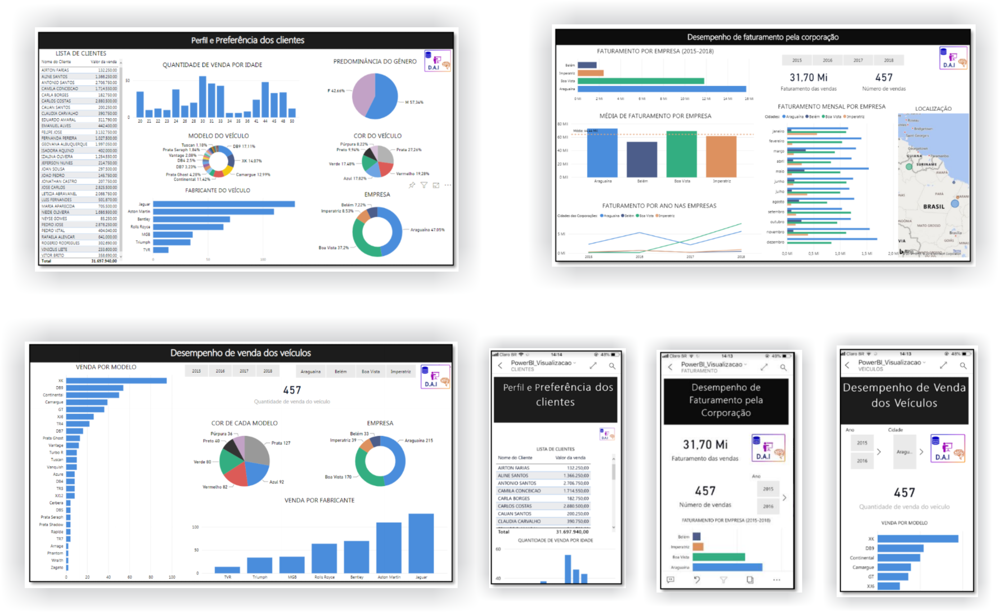

   

# Utilizando Power BI, SSIS e SSAS para gerar insights em uma concessionária de veículos
*Meu primeiro projeto de Business Intelligence. (As informações aqui contidas são apenas ilustrativas para estudos.)*

  

## Análise das necessidades:
  O objetivo da aplicação dos metodos de BI nesse projeto são  para obter os seguintes conhecimentos:
* Desempenho do faturamento da corporação:
1. Qual o valor de faturamento e número de veículos vendidos por ano
(2015-2018) da corporação?

2. O faturamento das corporações estão acima ou abaixo da média?
* Desempenho do faturamento por veículo:
1. Quais modelos de veículos foram mais vendidos?
2. Como se encontra o comportamento de venda de cada fabricante?

* Perfil e preferência dos clientes:
1. Qual perfil predominante de cliente na escolha do veículo em cada
empresa?

## As ferramentas utilizadas:
* O SSIS: é uma plataforma que encontra se no pacote Business Intelligence Development Studio (BIDS) ou Visual Data Tools (SSDT) dependendo da versão do SQL Server utilizada, disponibilizada pela Microsoft, tem a finalidade de desenvolver processos de ETL.

* O SSAS é uma plataforma que também encontra se no pacote Business Intelligence Development Studio (BIDS) ou Visual Data Tools (SSDT) dependendo da versão do SQL Server utilizada, disponibilizada pela Microsoft, no qual permite o desenvolvimento de estruturas multidimensionais chamados cubo e modelo de mineração para a realização de análise de dados.

* SQL é uma linguagem de programação para modelos relacionais com a finalidade de manipulação, controle, transação e consultas de dados, desenvolvida pelo projeto System R nos laboratórios de IBM em San Jose.

## Modelagens do Data Warehouse:
   Nessa fase, o objetivo é definir o escopo para a criação do modelo do data warehouse logico e físico. O modelo escolhido para a modelagem do data warehouse foi o esquema estrela, composta por dimensões e fato, no qual tem como principal vantagem a fácil visualização dos dados e redução do número de Joins.
### Tabela dimensão:
* Dimensão Cliente: Dimensão onde é encontrado informações básicas do cliente. Tendo como chave primária código do cliente e atributos nome, idade e género do cliente.

* Dimensão Tempo: Dimensão onde é encontrada a chave primária controle e atributos data (dia/mês/ano) e ano em que cada dimensão é analisada.

* Dimensão Veiculo: Dimensão onde é encontrado as principais características do veículo. Tendo como chave primária código do veículo
e atributos modelo, cor, fabricante do veículo.

* Dimensão Loja: Dimensão onde é encontrado informações básicas da loja. Tendo como chave primária código da loja e atributos, cidade e
estado da loja.

### Tabela Fato: 
* Fato venda: Fato onde é encontrada a chave primária código venda e as chaves primárias das dimensões, código da venda, código do cliente, código da loja, código da data, código do veículo. Para as quais podem se navegar e analisar as informações desejadas. Este fato consiste também em a medida.

#### Modelo Lógico  do data Warehouse

  

#### Modelo Físico do data Warehouse
*Data-warehouseModelo/Modelo Fisico Create do data warehouse.sql*

## Processo de ETL:
Para a criação do ETL foi dividido o processo em pacotes, contendo em cada pacote uma tabela para um melhor entendimento. Assim, para
cada tabela é criado um mapeamento especificando de onde as informações estão sendo obtidas e para onde serão carregadas.

*BI-Concessionaria-de-carros/Processos de ETL/*

 * As respectivas tabelas DIM_LOJA, DIM_CLIENTE, DIM_VEICULO foi utilizada em seu fluxo de dados o componente Excel Source, correspondente a fonte de origem, seguido pela transformação Data Conversion, responsável por converter os tipos de dados das colunas de entrada em uma nova coluna de acordo com o padrão dos dados de saída, para não haver nenhuma incompatibilidade no momento do armazenamento. Por sua vez, a transformação Sort foi encarregada de ordenar os dados de entrada de modo crescente e remover as linhas duplicadas. Por fim, foi aplicado o componente OLE DB Destination, no qual foi vinculado ao data warehouse criado e mapeado com os dados aqui tratados para a carga do mesmo.
 
 * A tabela DIM_TEMPO no fluxo de dados foi usada também o componente Excel Source e a transformação Data Conversion. Contudo, após foi aplicado a transformação aggregate, com a finalidade de agrupar os registros em dois grupos, um grupo contendo data de saída do veículo e outro grupo contendo ano de saída do veículo, possibilitando a combinação de dados ano e data, pois para cada ano de saída, possui várias datas de saída de veículos. Em seguida, foi utilizado a transformação Sort e por fim, foi aplicado o componente OLE DB Destination que vincula ao data warehouse para o armazenamento dos dados.
 
 * A tabela FATO_VENDA, no fluxo de dados foi utilizado o componente Excel Source e a transformação Data Conversion, seguido pela transformação lookup, responsável por combinar dois inputs em comum através de mapeamentos, relacionando os dados de uma origem com um DataSet, possibilitando popular as colunas código loja, código cliente, código veículo e código tempo na tabela fato_venda. Por fim, foi
aplicado o componente OLE DB Destination que vincula ao data warehouse para o armazenamento dos dados.

## Desenvolvimento dos Cubos:
A próxima etapa do processo businesses Intelligence foi o desenvolvimento de cubos OLAP, utilizando a ferramenta SQL Server Analysis
Services (SSAS).

*BI-Concessionaria-de-carros/Analise_Multidimensional_Concessionaria/*

## Desenvolvimento dos Dashboards:
Após ter passado pela obtenção de dados, tratamento, carregamento a fim de tornar os dados limpos e coerentes, a última etapa do processo BI é o desenvolvimento do dashboard para a visualização dos dados que possam responder as questões levantadas nas necessidades do negócio.

## Resultados Obtidos:

* **Desempenho de faturamento pela corporação:** É possível observar que o faturamento da venda de veículos das quatro empresas no período
entre 2015-2018 foi de 31.697.940,00, tendo um total de 457 veículos vendidos. Ainda revela que nesses mesmo período, a empresa localizada na cidade de Araguaína -TO é a líder de venda, tendo um faturamento de 15.725.000,00 e 215 veículos vendidos. Seguido da Boa Vista - RR com 11.799.710,00 e 170 veículos vendidos, Imperatriz- MA com 2.414.510,00 e 39 veículos vendidos e por último Belém-PA com 1.758.720,00 e 33 veículos vendidos. Foi possível ainda perceber que nesse mesmo período, apenas as empresas de Araguaína -TO e Boa Vista - RR teve um faturamento acima da média. O dashboard também revela como se comporta o faturamento das corporações por uma perspectiva anual e mensal.

* **Desempenho de venda dos veículos:** Apresenta informações sobre o fluxo de venda dos veículos. Os indicadores visuais aqui expostos revelam que o veículo XK do fabricante Jaguar é o modelo mais vendido nos últimos 4 anos, com 95 modelos vendido. Sendo 36 em Araguaína -TO, 51 em Boa Vista - RR, 4 em Imperatriz - MA e 4 em Belém -PA. Em contrapartida, no mesmo período o veículo que teve menos fluxo de saída foi o Zagato do fabricante Aston Martin, Wraith e Phantom do fabricante Rolls Royce, e Arnage do fabricante Bentley com 2 venda cada. Sendo, o Zagato com 1 saída em Araguaína – TO e 1 Imperatriz – MA e Wraith, Phantom e Arnage com 2 saídas de cada em Araguaína -TO. O presente dashboard também possibilita a análise de desempenho das saídas por fabricante de cada veículo. Tendo como líder o fabricante Jaguar com 129 veículos vendido, sendo 61 em Araguaína - TO, 54 em Boa vista - RR, 9 em Belém -PA e 5 em imperatriz -MA. E o fabricante com menos venda foi o TVR com 14 veículos vendidos, sendo 8 em Boa Vista - RR, 3 em Araguaína - TO, 2 em Belém- PA e 1 em Imperatriz - MA.

* **Perfil e preferência dos clientes:** Nesse painel tem a intenção de explorar o perfil e preferência dos clientes. Os indicadores visuais aqui expostos revela que o perfil de cliente que mais concretizar a compra são do gênero masculino com 57.34% com a faixa etária de idade entre 24-31. Sendo o modelo preferido pelo gênero masculino o DB9, com 10.57%, Continental com 10.46% e XK com 9.9%. Em contrapartida, o que se refere ao gênero feminino, a faixa etária é de 26-33 anos e a preferência fica entre os modelos XK com 19.69%, Camargue com 17.74 % e Continental com 12.71%. Na perspectiva por empresa, o dashboard aponta que a empresa situada em Araguaína- TO tem como maior perfil de cliente que finalizam as compras de veículos são o do gênero masculino, com 95.81%, em Boa Vista - RR o do gênero feminino com 91.46%, Imperatriz -MA o gênero feminino com 52.03% e em Belém-PA o gênero masculino com 53.63%.

